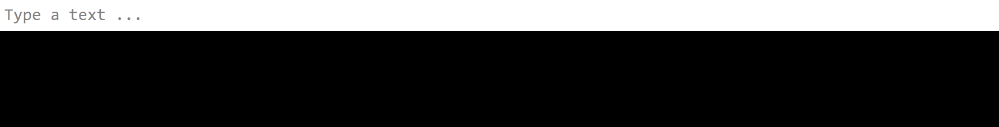

<!-- Header -->
[⬅️ Back to main page](https://github.com/JonasKoenig/CodeOnMyMind) &nbsp;
[💾 Download](https://minhaskamal.github.io/DownGit/#/home?url=https:%2F%2Fgithub.com%2FJonasKoenig%2FCodeOnMyMind%2Ftree%2Fmaster%2Fprojects%2Fbinary)

# Binary Information

One field in computer science is representing information in a way computers can understand them - zeros and ones. In this article, we will see relatively easy representations of numbers and text and touch on more complex image and video encodings.

## Numbers

The most widely used number system is the decimal system or the base-ten system. We have ten digits `0-9` and if we want to express a bigger number we add another digit. The position of each digit is essential to its value.

```
  243 = 2*100 + 4*10  + 3*1
      = 2*10² + 4*10¹ + 3*10⁰
    --> 2       4       3
```

To determine the value of a number, each digit is multiplied by the power of ten corresponding to its position.

So far, we recapped the first grade 🎓. Now for the binary system (base-two system): We are now constrained to only two digits `0` and `1`.

```
  243 = 1*128 + 1*64 + 1*32 + 1*16 + 0*8  + 0*4  + 1*2  + 1*1
      = 1*2⁷  + 1*2⁶ + 1*2⁵ + 1*2⁴ + 0*2³ + 0*2² + 1*2¹ + 1*2⁰
    --> 1       1      1      1      0      0      1      1
```

Appending all binary digits from this decomposition yields the binary representation `11110011`.

We use the notation `(243)₁₀ = (11110011)₂` to distinguish the two systems. That is the number to binary conversion in a nutshell.

<details>
  <summary><b>Expand</b> to see, that the hexadecimal system works exactly the same way</summary>

  We need 16 digits, so we keep `0-9` and add `A = 10`, `B = 11`, `C = 12`, `D = 13`, `E = 14` and `F = 15`.

  ```
    243 = 15*16  + 3*1
        = 15*16¹ + 3*16⁰
        =  F*16¹ + 3*16⁰
      -->  F       3
  ```

  So `(243)₁₀ = (F3)₁₆`.

</details>

## Text

Text conversion does not rely on calculation, but a conversion table.

The **ASCII** (*American Standard Code for Information Interchange*) uses 7 bits to encode characters and various control symbols.

| Character | Binary   |
|:---------:|:--------:|
| A         | 100 0001 |
| B         | 100 0010 |
| C         | 100 0011 |
| ...       | ...      |

A more modern approach is **UTF-8**, sometimes called Unicode. It includes more than the basic symbols. Therefore it needs longer bit sequences to differentiate between the characters.

See my encoding demo and play around with different texts:




## Images

## Video

## Compression
