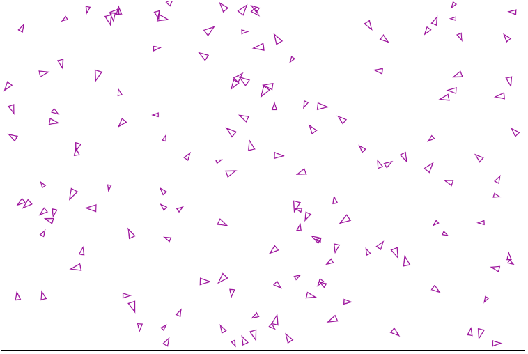

<!-- Header -->
[⬅️ Back to main page](https://github.com/JonasKoenig/CodeOnMyMind) &nbsp;
[💾 Download](https://minhaskamal.github.io/DownGit/#/home?url=https:%2F%2Fgithub.com%2FJonasKoenig%2FCodeOnMyMind%2Ftree%2Fmaster%2Fprojects%2Fboids)

# A Murder Of Boids

For this project we attempt to simulate flocking behavior of birds or fish. Craig Reynolds describes his approach in [his paper](https://www.red3d.com/cwr/boids/) from 1986. The simulation of the "Boids" - as he calls them - is characterized by three behaviors.

1. Separation
2. Alignment
3. Cohesion

See the resulting interactive simulation here: https://editor.p5js.org/JonasKoenig/present/izzzAAkvO

## Basic Setup

I created a basic scene in processing showing a whole bunch of Boids. Each individual is defined by a position, a velocity and an acceleration. Boids are displayed as a triangle heading in the direction of their speed. Their size indicates their maximum speed which varies between different Boids. The GIF below shows the most basic form of this setup - without any flocking behavior.

## Separation

According to the above mentioned paper, separation is the first of three flocking behaviors. Basically Boids are incentivized to avoid collisions.

## Alignment

Now we go back to ignoring separation to demonstrate the alignment behavior. Boids will now steer towards the average direction of their neighboring Boids. The GIF below shows the group slowly aligning to one direction as we dial up the alignment slider.

## Cohesion

The last property is cohesion. We now implement the incentive for Boids to move to the average location of their neighboring Boids. Now every Boid wants to be in the center of the group - safe and sound.

## Flocking Behavior

All of these behaviors individually might look strange. But if we put them together and fiddle with the sliders to adjust their intensity, we are able to create a convincing flock simulation.

If you want to play around, see the resulting simulation here: https://editor.p5js.org/JonasKoenig/present/izzzAAkvO

## Outlook and Credit

This simple demonstration could be extended by a number of interesting ways:

- Here **awareness** of other Boids is simulated by a radius around each Boid. That could be switched to a more appropriate field of vision, that e.g. does not allow Boids to look behind them.

- **Stamina** is unlimited in this simple simulation, but what interesting behavior could emerge if Boids in the front tire faster than Boids in their slipstream.

- **More Boids!** A more efficient method of calculating the set of neighboring Boids is a quadtree. Implementing this structure would allow for more Boids without losing too much performance. In this small sketch 150 Boids seems to be a reasonable limit.

- Equip all Boids with **rigid bodies** so they really cannot awkwardly overlap.

I was heavily influenced by a cool video on the topic. Check out [The Coding Train](https://youtu.be/mhjuuHl6qHM) by Daniel Shiffman.
