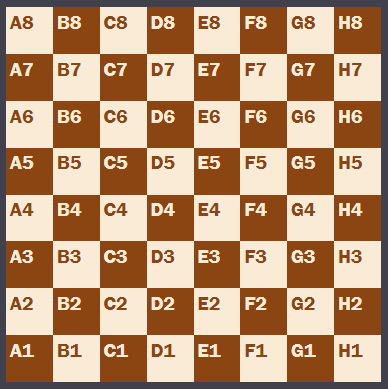
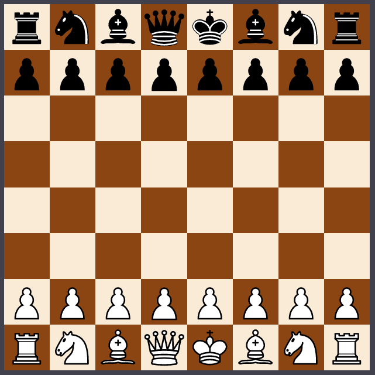

<!-- Header -->
[⬅️ Back to main page](https://github.com/JonasKoenig/CodeOnMyMind) &nbsp;
[💾 Download](https://minhaskamal.github.io/DownGit/#/home?url=https:%2F%2Fgithub.com%2FJonasKoenig%2FCodeOnMyMind%2Ftree%2Fmaster%2Fprojects%2Fchess)

# Let's code a chess game - how hard can it be?

I am one of those people who watched the series "The Queen's Gambit" and subsequently really got into chess.  For this project, I will try to code a playable chess board in Javascript. I imagine it will be quite hard to iron out all the bugs since chess has a few rules that are not simple to implement - pinned pieces, en passant, etc. My goal is to make the development process as transparent as I can.

## 1. A world in 64 squares

A chess board has 64 squares that alternate between black and white - let's start there. I create a HTML document to hold a `div`-element. This `div` holds the board and is the only thing we need for our game right now. Later on it can be extended to show a clock or the material balance.

The HTML document links to a CSS-stylesheet. I will try to contain all or most of the cosmetic code in this stylesheet. Here, we define the dimensions of the board and the colors for the squares.

Now for the game logic: I create `loop.js` to start the game loop when `index.html` is loaded by a browser. The board and the pieces are created in separate documents using an object-oriented approach. The board object holds an array of squares. The squares are created using two nested for-loops. The outer loop determines the `file` (A-H) of a square and the inner loops iterates through the `ranks` (1-8). A squares `color` is black if the sum of file and rank is even. Every other square is white. All fields are initialized to be empty. This `occupant` field will hold pieces later on.

    
Preview

    

## 2. Populating the board with pieces

The chess community provides us with a consise notation to describe any chess position. The Forsyth–Edwards Notation or FEN for short (see [Wikipedia](https://en.wikipedia.org/wiki/Forsyth%E2%80%93Edwards_Notation)) will be the basis for populating the board with pieces. The notation states which pieces occupy which squares and basic information about the game state like whos turn it is and castling rights. In this stage we have a board that can display any position described by a FEN notation.

    
Preview

    

- model und view stärker verknüpfen
- click events aufräumen
- game state refactoring
- active and inactive pieces

## 3. Interaction

🚧 in progress

## Interlude

## Testing

## Valid Moves

## Win Conditions

## Instant Replay