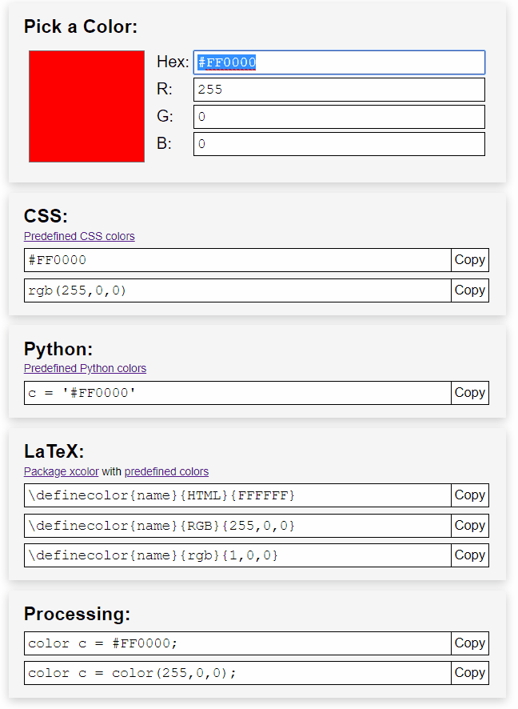

[⭠ Back to main page](https://github.com/JonasKoenig/CodeOnMyMind) &nbsp;
[⭳ Download](https://minhaskamal.github.io/DownGit/#/home?url=https:%2F%2Fgithub.com%2FJonasKoenig%2FCodeOnMyMind%2Ftree%2Fmaster%2Fprojects%2Fcolors)

# Colors

Working with different color formats can be a pain. Different formats work with

- `[0.0, 1.0]` float values
- `[0, 255]` integer values
- `[00, FF]` hexadecimal values

I created this converter a while back. Now, that I chose to share it with you, I refactored the code a bit and cleaned the page up. I added a HTML5 color input, which I think is a handy form of input. Several read-only input fields show the piece of code to include the resulting color in different languages. For further convenience buttons copy the code to your clipboard.

