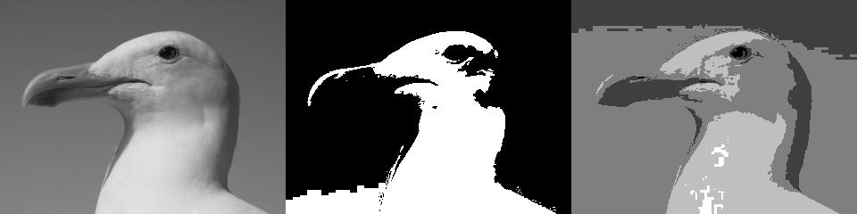
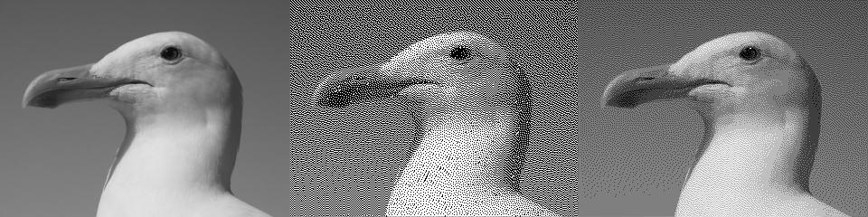

<!-- Header -->
[⬅️ Back to main page](https://github.com/JonasKoenig/CodeOnMyMind) &nbsp;
[💾 Download](https://minhaskamal.github.io/DownGit/#/home?url=https:%2F%2Fgithub.com%2FJonasKoenig%2FCodeOnMyMind%2Ftree%2Fmaster%2Fprojects%2Fdithering)

# Dithering

Dithering is a technique to reduce an images color palette without losing too much of information. We compare plain quantization and dithering.

## Quantization

The original image works with greyscale values between `0` (black) and `255` (white). Quantization reduces this range to an arbitrary number of steps `n`. Below we can see the effect of quantization for `2` and `5` steps. The sea gull is clearly less recognizable.



Figure 1: _original image of a sea gull, quantized version with two steps and five steps_

## Dithering

Dithering is an attempt to reduce the color palette while preserving recognizability. The quantization error of one pixel is distributed to the neighboring pixels, thereby creating the characteristic dotted pattern. The sea gull remains recognizable.




Figure 2: _original image of a sea gull, dithered version with two steps and five steps_

The quantization error is simple to calculate: `old pixel - new pixel`. The error is then distributed to neighboring pixels:

<table>
  <tr>
    <td></td>
    <td><center>*</center></td>
    <td>7/16</td>
  </tr>
  <tr>
    <td>3/16</td>
    <td>5/16</td>
    <td>1/16</td>
  </tr>
</table>

[Wikipedia](https://en.wikipedia.org/wiki/Floyd%E2%80%93Steinberg_dithering) describes the algorithm by Floyd and Steinberg as pseudo code. I wrote the algorithm in python and I think the resulting script is quite readable.

```python
for y in range(1, img.width-1):
    for x in range(0, img.height-1):
        oldpixel = pixels[x][y]
        newpixel = quantize(oldpixel, n)
        pixels[x][y] = newpixel
        quant_error = oldpixel - newpixel
        pixels[x+1][y  ] += quant_error * 7 / 16
        pixels[x-1][y+1] += quant_error * 3 / 16
        pixels[x  ][y+1] += quant_error * 5 / 16
        pixels[x+1][y+1] += quant_error * 1 / 16
```
