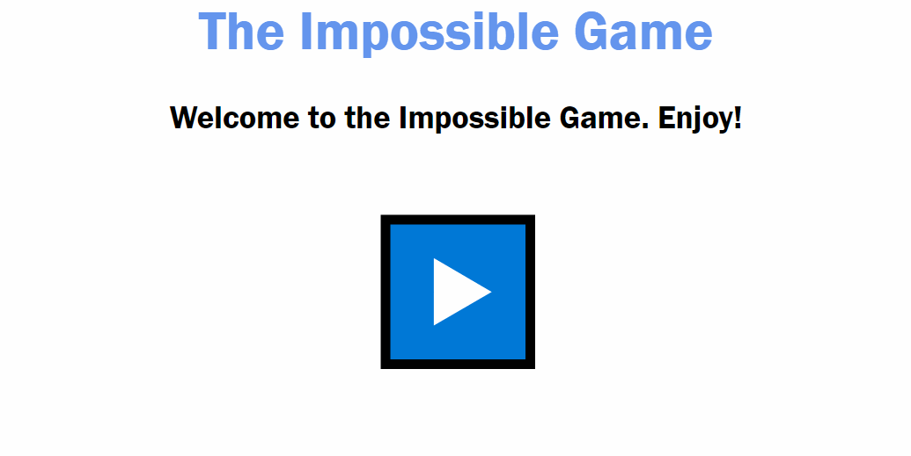

<!-- Header -->
[⬅️ Back to main page](https://github.com/JonasKoenig/CodeOnMyMind) &nbsp;
[💾 Download](https://minhaskamal.github.io/DownGit/#/home?url=https:%2F%2Fgithub.com%2FJonasKoenig%2FCodeOnMyMind%2Ftree%2Fmaster%2Fprojects%2Fimpossible) &nbsp;
[▶️ Play](https://impossible-game.herokuapp.com/)

# The Impossible Game

The idea for this project came to me when I thought about the astronomical odds to win the lottery. How can we grasp these tiny fractions?



<details open>
<summary><b>Click here to hide the math</b></summary>

For one lottery game players select six numbers out of 49 plus one additional super-number between zero and nine. The odds to hit the jackpot are calculated as follows:  You have 49 options for your first choice. The second choice has only 48 options because the first choice is taken. The third number is selected among 47 options and so on. The order of those numbers is irrelevant so we devide by the number of combinations. We end up with a common formula called binomial coefficient.

```
    n! / (k! * (n - k)!)
=  49! / (6! * 43!)
= (49 * 48 * 47 * 46 * 45 * 44) / (6 * 5 * 4 * 3 * 2 * 1)
= 13,983,816
```
This number is multiplied by 10 to account for the super-number. The resulting odds are 1 in 139,838,160 (roughly 1:140 million).

</details>

Recreating a lottery would make for a boring game so I created a series of fun questions. The questions have more and more answer choices thereby increasing the difficulty. Answering all questions correctly is roughly as likely as winning the lottery.

## Technical Considerations

This project was an exercise in the python server technology Flask. The server holds the data on the different levels and maps user answers to the next game state. Client and server cummunicate via POST requests.

The game runs on [this server](https://impossible-game.herokuapp.com/) hosted by Heroku. Have fun playing! 👋

Note: In the current state the answers are not randomized. I chose to keep it this way to give players the chance to explore all levels. This may change in the future.


