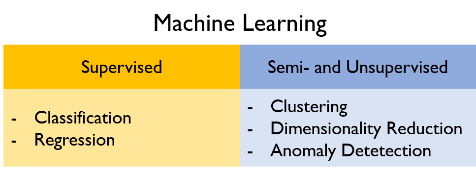

[⬅️ Back to main page](https://github.com/JonasKoenig/CodeOnMyMind) &nbsp;
[💾 Download](https://minhaskamal.github.io/DownGit/#/home?url=https:%2F%2Fgithub.com%2FJonasKoenig%2FCodeOnMyMind%2Ftree%2Fmaster%2Fprojects%2Fmachine-learning)

# Machine Learning

Machine Learning is a part of the wider field of artificial intelligence (AI). It is an attempt to learn something from existing data (_training data_) and apply that knowledge to new data (_test data_).

In this project I aim to give you a glimpse of what machine learning is and what interesting challenges it tries to solve.

## What is it?

In science, _induction_ is the process of inferring general rules from lots of examples. Drop various items for example - we may then infer that things fall to the ground. We do not know that rule to be true, but it is the best theory that explains what we observed.

Machine learning tries to automate that inductive process. We write an algorithm that takes a lot of examples (input) and infers properties about them (output).

## Different Kinds

The different kinds of machine learning are distinguished by their input. Mainly, do we know the correct answer up front or not? In this section I explain several task and provide examples to make it easier to understand.

### Supervised Learning

In the supervised setting we have a dataset _including_ the property we trying to learn. We try to link the input properties to their given output properties. Then we can predict the output property for any future data with their output property missing.

- __Classification:__ The desired output is a classification with discrete labels. Imagine a spam filter. Which rule determines, if an e-mail is classified as spam or proper mail?

- __Regression:__ If a number from a continuous range of values is what we need, we utilize regression. For instance estimating the price of a car by considering the brand, horsepower and gas mileage. Regression problems can be transformed into classification problems by choosing relevant intervals (`0$-15000$: cheap car, >15000$: expensive car`).

### Semi-Supervised Learning

We speak of semi-supervised learning, if only a small amount of the training data is labeled. The challenge is to find meaningful groups and infer their properties by looking at only a hand full of representatives.

One famous instance of semi-supervised learning is [_'Self-supervised learning model for skin cancer diagnosis'_](http://khairulanam.com/id/wp-content/uploads/2016/05/url_NER2015_An_Am.pdf). A doctor classified a few pictures of lesions. The remaining pictures were unlabeled, but still contributed to the learning process. This saved time and money.

### Unsupervised Learning

If we have no output information, we apply unsupervised learning. The learner is supposed to provide the structure of the data. Common tasks are:

- __Clustering__ is about identifying meaningful groups in the data set, i.e. find communities among user profiles in a social network.

- __Dimensionality Reduction:__ Picture a fictional data set about dogs. It may include information about name, age and breed, but also less useful information, like the weather conditions on their third birthday. Reducing dimensionality means determining a few key characteristics, that are important to tell different dogs apart.

- __Anomaly Detection:__ In data preprocessing we may want to discard data, that is too far apart from the rest of the data. For example we measure the temperature of room over the course of a year. Now we want to ignore the day our intern made himself a coffee directly underneath the thermometer. Anomaly detection aims to identify such outliers.

### Batch, Online and Active Learning

This last paragraph is concerned with how we acquire the training data:

- __Batch:__ We receive a bunch of data, apply our algorithms and we are done.

- __Online:__ Data trickles in one at a time, e.g. in spam filtering.

- __Active:__ The algorithm has access to the whole data set and _'asks'_ for the output solution of certain data points.

These are some different topics I have encountered and thought to be interesting. By no means is this list complete, but I hope I gave you an insight into the nebulous realm of machine learning. I will improve and expand upon this page as I go, so stay tuned :)
