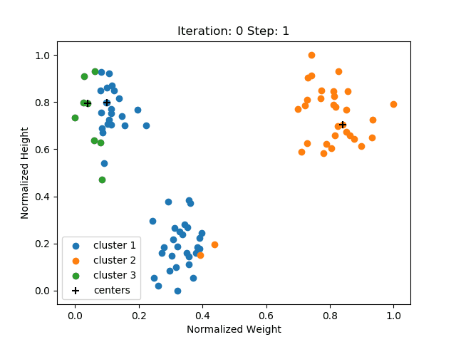
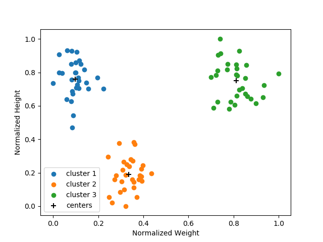

<!-- Header -->
[⬅️ Back to Machine Learning](https://github.com/JonasKoenig/CodeOnMyMind/tree/master/projects/machine-learning) &nbsp;
[💾 Download](https://minhaskamal.github.io/DownGit/#/home?url=https:%2F%2Fgithub.com%2FJonasKoenig%2FCodeOnMyMind%2Ftree%2Fmaster%2Fprojects%2Fmachine-learning%2Fkmeans)

# *k*-Means Algorithm

The *k*-Means algorithm clusters unlabeled data (unsupervised learning). Clustering means dividing a lot of data into meaningful groups.

Consider, for example, a data set about animals. The information we have about each individual animal is its height and its weight. A plot of this data set might look like this:

As you can see, there seem to be three distinct groups of animals. If you cannot see it try squinting your eyes 😊. If we were to describe these groups manually, we might say: *'The upper-left group has a height around 200 cm and a weight around 1000 kg.'* and so on ...

The clustering algorithm *k*-Means does just that, but automatically. It aims to distinguish the three groups by providing a mean value. But, how do we choose a suitable value?

## How it works

During the **initialization**, we pick *k* points in the input space. I will refer to them as centers. There are different ways of acquiring the initial centers. In this simple demonstration I pick *k* data point at random. The algorithm then alternates between two steps:

1. **Assign data:** Go through all data points and assign them to their closest center.
2. **Adjust centers:** Update the centers to be the mean of all data points assigned to it. Of course, moving the centers can cause the assignments to change in the next iteration.

Repeat, until the assignments no longer change.

Final result:

## Outlook

This algorithm illustrates how important it is to choose a proper parameter. Ideally, data scientists understand the data set well enough to know what they are looking for. In this case, how many clusters are you looking for? There is no one-size-fits-all solution.

This ties into a larger theme. Machine Learning does not do all the thinking for you (yet). You have to be there and use it intentionally.
