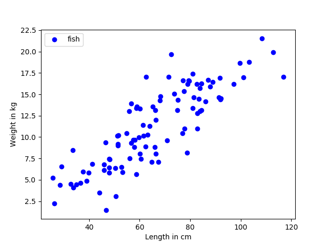
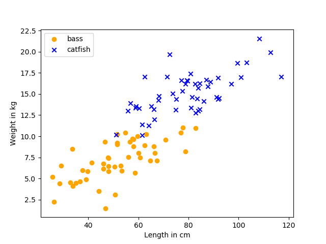
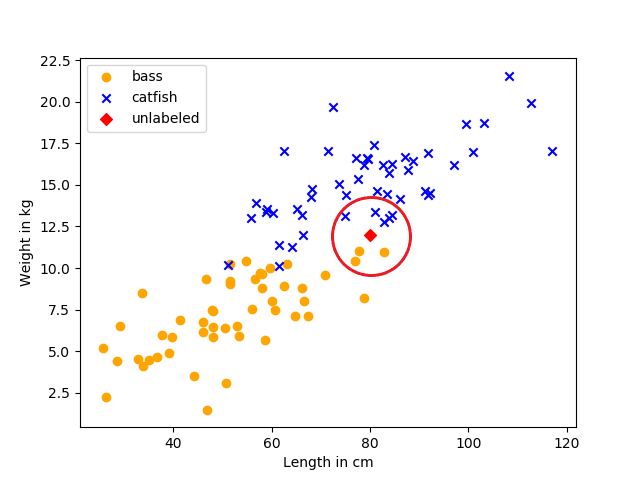

[⭠ Back to machine learning](https://github.com/JonasKoenig/CodeOnMyMind/tree/master/projects/machine-learning)

# *k* Nearest Neighbor Algorithm

The *k* Nearest Neighbor (kNN) algorithm is a basic classification algorithm for supervised learning (If you do not know what that means, consider reading [this](https://github.com/JonasKoenig/CodeOnMyMind/tree/master/projects/machine-learning)). I will take you through several steps in understanding what kNN does.

## Step 1: What the *fish* are you talking about?

In this running example we classify fish using their length and weight as input data. Since we are in a supervised learning setting, we know the matching labels (desired output) for our data. Therefore, our data set looks like this:

|     | Length | Weight |  Label  |
|:---:|-------:|-------:|:-------:|
|   1 |     23 |   2.51 |    bass |
|   2 |     25 |   3.01 |    bass |
|   3 |     13 |   1.69 | catfish |
|   4 |     17 |   2.42 | catfish |
|   5 |     21 |   2.36 |    bass |
| ... |    ... |    ... |     ... |

Each row represents the data for one fish. Now we plot length against weight.

As you can see longer fish are heavier. Another useful information is the label of the fish.

On average, the catfish are longer and heavier. Sorry to all fish enthusiasts if these numbers are wildly inaccurate. Humans can distinguish the two kinds of fish in this plot, but can we make a machine do it?

## Step 2: Classifying with kNN

Yes, of course we can make the machine do it. For every new unlabeled data point, the kNN algorithm will determine the *k* nearest data points and do a simple majority vote. In our example k is eight. There are five catfish surrounding the new data point and only three basses. The new data point will be classified as a catfish.

For this to work in a formal setup, kNN needs a **distance function**, that is used to determine the k *'nearest'* neighbors. In this case we could use the Euclidean distance:

Using this distance function we can predict the label of one data point.

## Step 3: Decision Boundary

We can also learn what is called a decision boundary - a line separating the two groups. This will facilitate classifying larger amounts of new data.

Code will follow

## Step 4: Evaluating Accuracy
