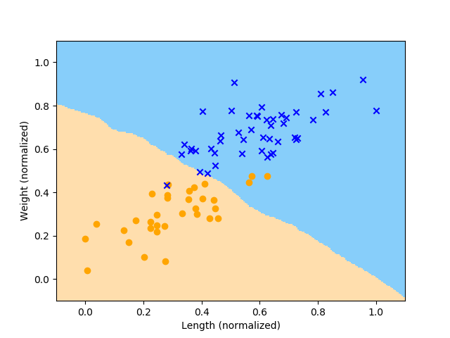

<!-- Header -->
[⬅️ Back to Machine Learning](https://github.com/JonasKoenig/CodeOnMyMind/tree/master/projects/machine-learning) &nbsp;
[💾 Download](https://minhaskamal.github.io/DownGit/#/home?url=https:%2F%2Fgithub.com%2FJonasKoenig%2FCodeOnMyMind%2Ftree%2Fmaster%2Fprojects%2Fmachine-learning%2Fknn)

# *k*-Nearest-Neighbor Algorithm

The *k*-Nearest-Neighbor (kNN) algorithm is a basic classification algorithm for supervised learning (If you do not know what that means, consider reading [this](https://github.com/JonasKoenig/CodeOnMyMind/tree/master/projects/machine-learning)). I will take you through several steps in understanding what kNN does.

## Step 1: What the *fish* are you talking about?

In this running example we classify fish using their length and weight as input data. Since we are in a supervised learning setting, we know the matching labels (desired output) for our data. Therefore, our data set looks like this:

|     | Length | Weight |  Label  |
|:---:|-------:|-------:|:-------:|
|   1 |     23 |   2.51 |    bass |
|   2 |     25 |   3.01 |    bass |
|   3 |     13 |   1.69 | catfish |
|   4 |     17 |   2.42 | catfish |
|   5 |     21 |   2.36 |    bass |
| ... |    ... |    ... |     ... |

Each row represents the data for one fish. Now we plot length against weight. (See `1-plot.py` on how to do this)

As you can see longer fish are heavier. Another useful information, we want to display, is the label of the fish.

On average, the catfish are longer and heavier (Sorry to all fish enthusiasts if these numbers are wildly inaccurate). Humans can distinguish the two kinds of fish in this plot, but can we make a machine do it?

## Step 2: Classifying with kNN

Yes, of course we can make the machine do it. For every new unlabeled data point, the kNN algorithm will determine the *k* nearest data points and do a simple majority vote. In our example k is eight. There are five catfish surrounding the new data point and only three basses. The new data point will be classified as a catfish.

For this to work in a formal setup, kNN needs a **distance function**, that is used to determine the *nearest* neighbors. In this case we could use the Euclidean distance:

Using this distance function we can predict the label of one data point. Usually it is a good idea to scale both axes to a range of `0` to `1` (normalization). Otherwise the fishes lengths carry more weight in the classification process, because they tend to be the larger numbers.

In `2-classify.py` kNN predicts 'catfish' for the new data point, just as intended.

## Step 3: Evaluating Accuracy

We use the test data to estimate the accuracy of our algorithm. We predict the label of every test point and compare it to the test labels, we know to be correct. Remember: We know the correct label, because this is supervised learning.

In `2-classify.py` kNN scores 95% accuracy for this fish example.

## Step 4: Decision Boundary

We can also learn what is called a decision boundary - a line separating the two groups. This will facilitate classifying larger amounts of new data. Data points in the blue area will be classified as catfish, points in the orange area will be predicted as basses.

Note: Some points are missing in this plot, because the training data is only a part of the data set we looked at in previous plots.

## Step 5: Underfitting and Overfitting

Admittedly these plots did not turn out great. I still hope to convey what the phenomena of underfitting and overfitting mean.

Underfitting is the more intuitive side of this spectrum. If we choose a boundary, that is too simple to explain the complexities of our training data, new data will often be misclassified. If we choose a very large *k*, the kNN algorithm will always classify new data with the most common label in our training set.

If we choose *k* too small (in this case k=1) the algorithm will overfit. Our goal is to generalize from the training data, so we are prepared for all kinds of new data. If we fit the decision boundary too well to the training data, the generalizing character of learning is lost.

## Outlook

The tricky part for any data scientist is to choose the parameters, that make machine learning work - in this case *k*. There is no *one size fits all* solution. One approach to automate the parameter choice is cross validation. I will explain cross validation in my project on Support Vector Machines (coming soon).
