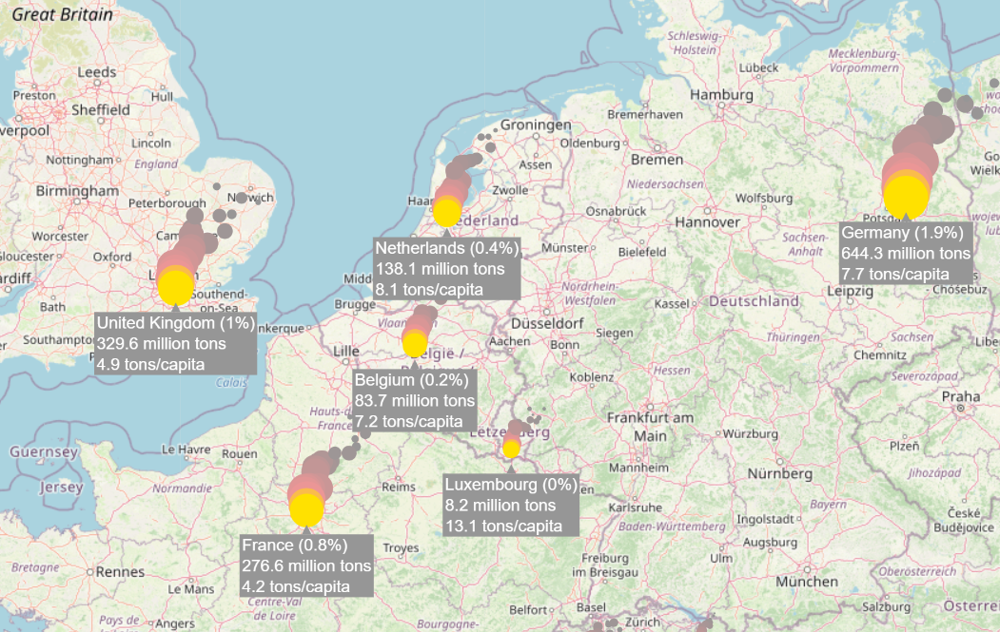

<!-- Header -->
[⬅️ Back to main page](https://github.com/JonasKoenig/CodeOnMyMind) &nbsp;
[💾 Download](https://minhaskamal.github.io/DownGit/#/home?url=https:%2F%2Fgithub.com%2FJonasKoenig%2FCodeOnMyMind%2Ftree%2Fmaster%2Fprojects%2Fmap)
[▶️ Try it](https://jonaskoenig.github.io/CodeOnMyMind/projects/map/)

# CO₂ Emission Map

Explore carbon footprints from all over the world in my interactive map. The annual CO₂ emissions are visualized as a small fire. A larger the flame means a larger footprint. As we zoom the map reveals more information on each country.

The map is constructed using object-oriented programming. The file `script/map.js` holds the main loop for the animations. The fire animation iteself is made up of a particle emitter that spews out appropriately sized and colored particles (circles). I created a separate class for the tooltips that are revealed as we zoom in. 

### Libraries

The visualisations are created using [p5.js](https://p5js.org/). A simple javascript framework for drawing on a canvas. [Mappa.js](https://mappa.js.org/) is a map library specifically designed for p5.js. Mappa provides several options for acquiring map data. Using [Leaflet](https://leafletjs.com/) is an easy way to connect to Open Street Maps.

### Data

All data was preprocessed using python. I use pandas dataframes to select columns of interest, filter data from 2020 and merge the CO₂ data with the appropriate GPS coordinates (See: `data/compile.py`)

- Our World in Data CO₂ Emission Data (2020): https://ourworldindata.org/co2-emissions
- World Capitals GPS: https://www.kaggle.com/nikitagrec/world-capitals-gps

### Try it

You can use the map on my [GitHub Pages](https://jonaskoenig.github.io/CodeOnMyMind/projects/map/) or run it locally on your computer:

- Open terminal
- Navigate to folder `map`
- Execute `python -m http.server`
- Open `localhost:8000` in your browser

### Possible Extensions for the future

- I only used a fraction of the CO₂ dataset. It also contains data for every year dating back to the 1950s. One possible extension would be to add a slider to select a specific year. This enables the user to compare emissions across five decades and see the development.

- CO₂ is not the only relevant gas. Other greenhouse gases are also part of the dataset.

- In addition to single countries we can also compare entire continents.