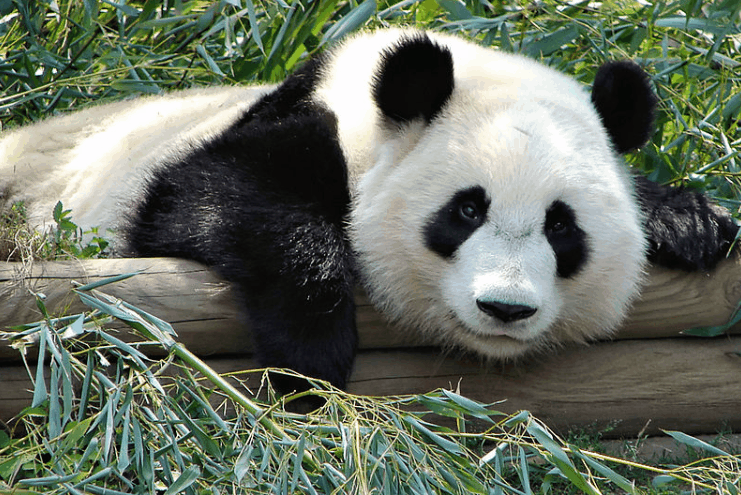
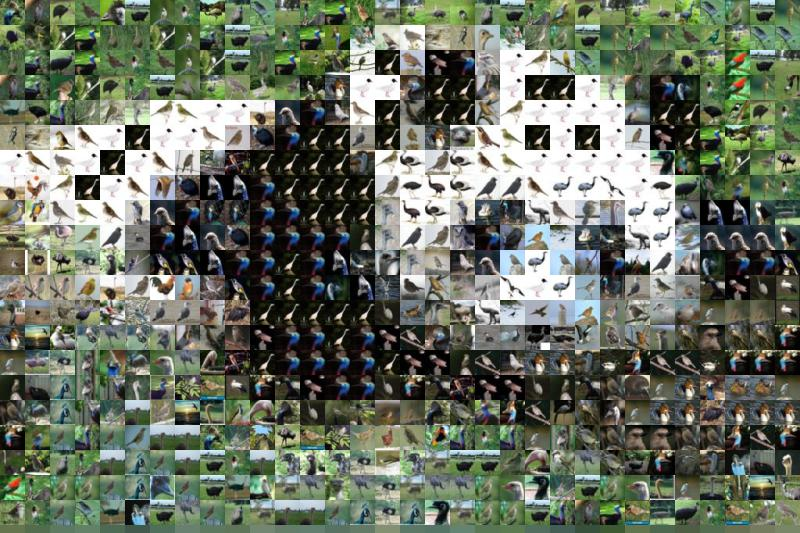

<!-- Header -->
[⬅️ Back to main page](https://github.com/JonasKoenig/CodeOnMyMind) &nbsp;
[💾 Download](https://minhaskamal.github.io/DownGit/#/home?url=https:%2F%2Fgithub.com%2FJonasKoenig%2FCodeOnMyMind%2Ftree%2Fmaster%2Fprojects%2Fmosaic)

# Mosaic

Have you ever wondered what a panda would look like if were made up of a lot of smaller birds? Then you came to the right place, 😉. In this project we use python to piece together a large image using a whole bunch of smaller images - thereby creating a sort of mosaic.



## How it works

In a first step the image is loaded to python by using the Pillow library (reference below). We then pixelate the original image. In a small square of pixels we pick the dominating color and apply it to all pixels within that square. In terms of code, this is achieved by scaling the entire image down and up again:

```python
smallImage = originalImage.resize(smallSize, resample=Image.BILINEAR)
pixelatedImage = smallImage.resize(originalImage.size)
```

The sampling filter `BILINEAR` interpolates all colors within each square.

We the load all images in the tiles directory. In order for the tiles to be matched to the appropriate position we calculate the dominant color for each tile. Analogously to the pixelation we scale down the tiles to 1x1 pixel and get its color value.

Now for the matching. The following function receives one color value - this will be a color value from the pixelated image - and returns the tile with the least different dominant color.

```python
def getClosestColor(c):
    tileDistances = [np.linalg.norm(np.subtract(t,c)) for t in tileColors]
    return np.argmin(tileDistances)
```

For the color comparison, we calculate the vector norm between the two color vectors. This boils down to the length of the difference of the two vectors: `sqrt(r^2 + g^2 + b^2)` using `[r,g,b] = t - c`.

Next, we apply this matching function to all squares in the pixelated image:

1. Get the color from the pixelated image
2. Determine the closest matching tile
3. Get the tile and resize it to fit the square
4. Calculate the tiles position
5. Paste the tile

```python
color = np.array(smallImage)[y,x]
index = getClosestColor(color)
tile = tileImages[index].resize((grid, grid))
position = ((x*grid), (y*grid))
mosaic.paste(tile, position)
```

The script took around five seconds to run on the panda example. I think the most time consuming part is matching one of the 1000 tiles to one specific color. The resulting mosaic looks like this:



## How to customize the code

Follow these steps to turn one of your images into a mosaic:

- Copy your picture to the `media` directory
- Change the image path in the code to `img = Image.open("media/[<your-image>.jpg")`
- Run the script - but beware! Larger pictures will take longer

You can even customize the code further:

- Change `grid = 25` to a number you like - smaller values will yield more tiles, but increase the running time of the script
- Replace the images in the `tiles` directory if birds are not really your thing

## Possible Extensions

- The current version produces a few **artifacts**. Some of the really bright pixels are replaced by a dark tile. I was not able to find the cause of this problem, but I suspect there is something in the way I calculate the difference of two colors that I have not thought of.
- Each tile is **unique**. One could extend the code to use each tile only once.
- Tiles could have **different sizes**. Maybe a large uniform portion of the image could be covered by one tile. This would involve changing the way the image is segmented.

## Resources

- Bird Images: Image Recognition Training Data CIFAR-10 (birds only), kindly provided by [Yoongi Kim](https://github.com/YoongiKim/CIFAR-10-images/tree/master/train/bird)
- Python Imaging Library: [Pillow (PIL Fork)](https://pillow.readthedocs.io/)
