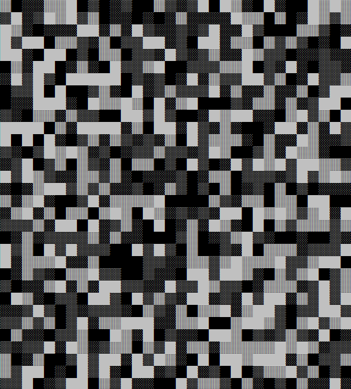
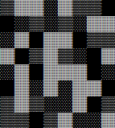
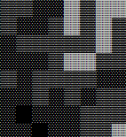
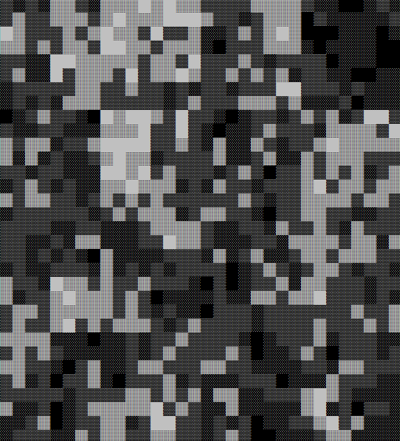

[⭠ Back to main page](https://github.com/JonasKoenig/CodeOnMyMind) &nbsp;
[⭳ Download](https://minhaskamal.github.io/DownGit/#/home?url=https:%2F%2Fgithub.com%2FJonasKoenig%2FCodeOnMyMind%2Ftree%2Fmaster%2Fprojects%2Fnoise)

# Experimenting with Noise

In this code snippet I create 2D noise maps in python.

_What are noise maps and what are they good for?_ One trend in modern video games is procedural generation. In procedural generation the map or non-player characters are not designed by a human, but generated according to rules, while the game is running. 2D noise maps assign a greyscale value to every `(x,y)` coordinate. These noise maps may be used as height maps - dark is low terrain, bright is a mountain. They can also distribute resources over a map or act as a texture.

## Random Noise

Random noise is random :) The values for each coordinate are completely independent. This is easy to implement:

```python
map = np.random.rand(size,size)
```

In a square of dimensions `size * size` random values are assigned. I then printed the noise map with unicode shades to make the result easier to comprehend.

```python
shades = ['  ', '░░', '▒▒', '▓▓', '██']
string = ''
for y in range(0,size):
    for x in range(0,size):
        string += shades[int(np.floor(map[y][x]*(len(shades))))]
    string += '\n'

print(string)
```

This yields a very coarse noise map:




## Level-of-Detail Noise

Sometimes noise needs to be smoother. For example, if the noise map is used as a height map, random noise would result in a blocky map with lots of inaccessible columns. In an attempt to create **coherent noise** I developed an approach where smaller random noise maps are scaled up and added on top of each other. Here is the idea applied to a small example:

#### Level 0
initial random noise map:




#### Level 1 (new noise map, upscaling does not do anything yet)
```
[1 1 0 0 1 0 1 1]   [1 1 0 0 1 0 1 1]
[1 0 0 1 1 0 1 0]   [1 0 0 1 1 0 1 0]
[0 1 1 1 0 0 1 0]   [0 1 1 1 0 0 1 0]
[0 0 0 1 1 1 0 0]   [0 0 0 1 1 1 0 0]
[1 0 1 1 1 1 0 0]   [1 0 1 1 1 1 0 0]
[0 0 1 0 1 0 1 1]   [0 0 1 0 1 0 1 1]
[1 0 1 1 0 1 0 0]   [1 0 1 1 0 1 0 0]
[1 1 0 1 0 1 0 1]   [1 1 0 1 0 1 0 1]
```

#### Level 2 (noise map with upscaled version)
```
[0 0 1 1]   [0 0 0 0 1 1 1 1]
[0 0 1 1]   [0 0 0 0 1 1 1 1]
[1 1 0 0]   [0 0 0 0 1 1 1 1]
[0 0 0 1]   [0 0 0 0 1 1 1 1]
            [1 1 1 1 0 0 0 0]
            [1 1 1 1 0 0 0 0]
            [0 0 0 0 0 0 1 1]
            [0 0 0 0 0 0 1 1]
```


#### Level 3 (last level of datail)
```
[1 1]   [1 1 1 1 1 1 1 1]
[0 1]   [1 1 1 1 1 1 1 1]
        [1 1 1 1 1 1 1 1]
        [1 1 1 1 1 1 1 1]
        [0 0 0 0 1 1 1 1]
        [0 0 0 0 1 1 1 1]
        [0 0 0 0 1 1 1 1]
        [0 0 0 0 1 1 1 1]
```

#### Aggregate
Summing everything up and normalizing by dividing by the number of levels will result in this smoothed noise map:



Adding different levels is done in this while loop:

```python
while 2**level < size:
    a = int(size/2**level)
    random_grid = np.random.randint(0, 1+1, size=(a,a))
    map += scale_up(random_grid, 2**level)
    level += 1
```

Again in 32x32 for comparison:



There are still some visible grid patterns, but it is much smoother than Random Noise. Feel free to play around with the two python scripts. I think python allowed for compact and elegant syntax in this project.


## Outlook
Most game engines use an algorithm called Perlin Noise. This is a much more sophisticated method of generating coherent noise. I might try to implement it in the future.

Also: Noise can be useful in higher dimensions. I chose 2D, because it simplifies explaining the concept.
