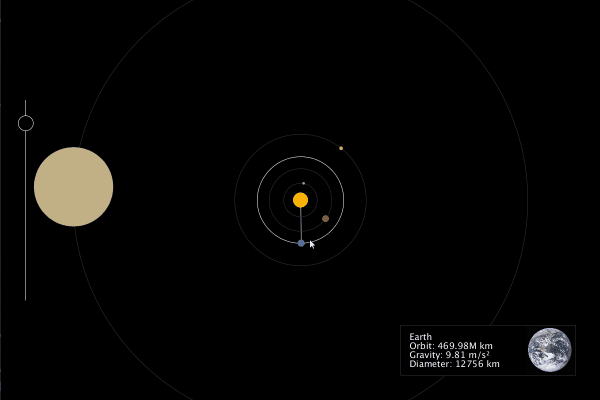

<!-- Header -->
[⬅️ Back to main page](https://github.com/JonasKoenig/CodeOnMyMind) &nbsp;
[💾 Download](https://minhaskamal.github.io/DownGit/#/home?url=https:%2F%2Fgithub.com%2FJonasKoenig%2FCodeOnMyMind%2Ftree%2Fmaster%2Fprojects%2Fplanets)

# Planets

This project is a quick visualization of our solar system I did a while back. The program is not very complex, but a nice example of object-oriented programming. All the code for this project was written in [Processing](https://processing.org/) - a java based framework particularly well suited for visual projects.



The main concept of object-oriented programming is to translate real-world objects into code. In this case I use the **class** `Planet` to represent the real-world object of planets. As you can see below classes encapsulate attributes of the object they describe.


```java
class Planet {

  String name;
  float orbit_diameter;
  float orbit_position;
  float orbit_speed;
  float planet_diameter;
  float planet_gravity;
  color planet_color;
  boolean mouseover;
  PImage img;

  ...
}
```

A class defines the abstract concept of a planet. In order to actually create an instance of that abstract description, we need to define and call a **constructor**. It is a function that takes a few parameters and creates a planet-object with initial attributes.

```java
  Planet (String name, float orbit_diameter, float orbit_duration, float planet_diameter, float planet_gravity, color planet_color, PImage img) {
    this.name = name;
    this.orbit_diameter = orbit_diameter;
    this.orbit_position = 0;
    this.orbit_speed = 1/orbit_duration;
    this.planet_diameter = planet_diameter;
    this.planet_gravity = planet_gravity;
    this.planet_color = planet_color;
    this.mouseover = false;
    this.img = img;
  }
```

Furthermore, objects can hold functions. The functions associated with an object should always perform an action on the object itself. When you build your own project, take a second to carefully decide what functions should belong to which class.

```java
  void animate() {
    orbit_position = ((orbit_position + orbit_speed*slider.speed())%360);
    this.display();
  }
```

The `animate` function is responsible for updating the planets position and thereby clearly should belongs to the planet-object.

It is time to create some planet-objects. The global function `setup` is called once in the beginning by the Processing framework. It is used to initialize all parts of the visualization. It is the perfect place to create the planet-objects and pass all relevant parameters like name, orbit diameter and speed, etc.

```java
void setup() {
  mercury = new Planet("Mercury", 58.9, 88, 4.879, 3.7, color(158, 154, 151), img_mercury);
  venus = new Planet("Venus", 108.16, 225, 12.103, 8.87, color(163, 86, 35), img_venus);
  earth = new Planet("Earth", 149.6, 365, 12.756, 9.81, color(46, 112, 173), img_earth);
  mars = new Planet("Mars", 228, 687, 6.792, 3.69, color(206, 174, 101), img_mars);
  ...
}
```

The global function `draw` is called 60 times per second by the Processing framework and implements all animation. In this function we now call the animate functions of all planets:

```java
void draw() {
  mercury.animate();
  venus.animate();
  earth.animate();
  mars.animate();
  ...
}
```

This is the basic setup of this project. Object-oriented programming was a great way of organizing the code, because it reflects real-world objects. In addition, all attributes of any one planet are neatly encapsulated in its own object - constant attributes like size and orbit diameter can neither be changed nor interfered with by other objects.

The object-oriented paradigm is a very wide-spread way of thinking about programming. A less frequently used, but just as powerful, paradigm is functional programming. Head over to my project on [Haskell](../haskell-notes) to get a feel for the difference between the two concepts.

If you want to play around with this projects code - just download the [Processing](https://processing.org/) framework and open up the `planets.pde` file provided here.
