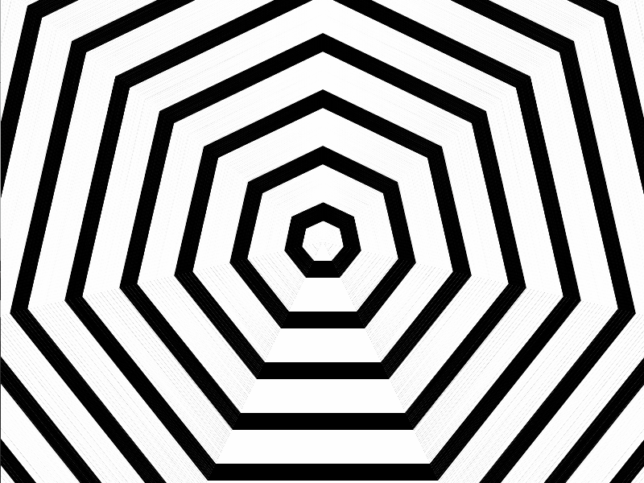

<!-- Header -->
[⬅️ Back to main page](https://github.com/JonasKoenig/CodeOnMyMind) &nbsp;
[💾 Download](https://minhaskamal.github.io/DownGit/#/home?url=https:%2F%2Fgithub.com%2FJonasKoenig%2FCodeOnMyMind%2Ftree%2Fmaster%2Fprojects%2Fscreensaver)

# Mesmerizing Screensavers

Time for something less academic. This project is only supposed to be pretty 🌈. I used processing to create some mesmerizing, screensaver-like animations. Feast you eyes:

  
<code>stars.pde</code>

  

  
<code>paint.pde</code>

  

  (Unfortunately, the GIF color palette is restricted, so this demo turned out a little strange)

  
<code>polgons.pde</code>

  

