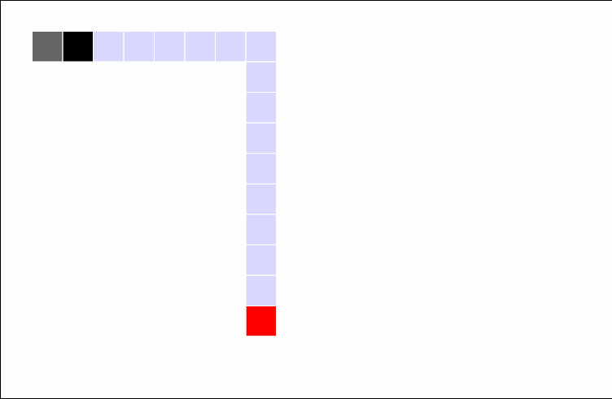

<!-- Header -->
[⬅️ Back to main page](https://github.com/JonasKoenig/CodeOnMyMind) &nbsp;
[💾 Download](https://minhaskamal.github.io/DownGit/#/home?url=https:%2F%2Fgithub.com%2FJonasKoenig%2FCodeOnMyMind%2Ftree%2Fmaster%2Fprojects%2Fsnake) &nbsp;
[▶️ Play](https://editor.p5js.org/JonasKoenig/sketches/NNNFIk87g)

# Autonomous Snake

This Coding-Challenge was part of a technical job interview. My first task was to implement the classic game snake. I used the Javascript drawing framework p5.js to do so. One script manages the game loop and holds all game objects. The snake as well as the food are separte classes that encompass relevant information like location and the snake's tail and methods to control these game objects. 

The second task was to make the game play itself thereby creating an autonomous snake. After some consideration I decided to implement the common pathfinding algorithm [A*](https://en.wikipedia.org/wiki/A*_search_algorithm). This search algorithm can find a shortest path through a graph (a network made up of nodes and edges connecting those nodes). In our case the graph is a grid map. Nodes are squares in this grid and the edges are the four neighboring squares. A* finds the shortest path between a start square 🟦 (location of snake's head) and a goal square 🟥 (food location). Starting at 🟦 we begin a loop:

1. Check if we have arrived at 🟥:
    - If yes, we're done.
    - If not we add all traversable neighboring squares to a to do list.

2. Choose the most promising square from the to do list. The square with the most promise minimizes a cost function `f = g + h`
    - g: distance from 🟦
    - h: estimated distance to 🟥 (heuristic)

3. Repeat the loop with the new square.

Using this outline I hope I demonstrated the idea for the A* path finding algorithm. You can play around with the game and the code on the [p5.js web editor](https://editor.p5js.org/JonasKoenig/sketches/NNNFIk87g). To turn off the autopilot just open up `game.js` and set `AUTOPILOT_ON = false`.

### Controls
- `Arrow` keys to steer snake
- `+`/`-` to increase/decrease snake length

### Known limitations
- The snake's tail is viewed as an obstacle in the moment the path is created. A better approach would be to give these obstacles a 'time-to-live' which might free up paths that cannot be discovered otherwise.
- While the snake has no available path it keeps moving in the same direction. During this time it would be better to perform simple evading manouvers.
