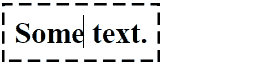

[⭠ Back to main page](https://github.com/JonasKoenig/CodeOnMyMind) &nbsp;
[⭳ Download](https://minhaskamal.github.io/DownGit/#/home?url=https:%2F%2Fgithub.com%2FJonasKoenig%2FCodeOnMyMind%2Ftree%2Fmaster%2Fprojects%2Fsvg-selection)

# Selections via SVG in CSS



In this snippet, I created a ‘marching ants’ animation to make a div appear selected. The whole thing was inspired by a talk I saw by Lea Verou (linked below).

HTML:
```html
<div class="selection" editable>Some selected text.</div>
```

CSS:
```css
.selection {
  background: url('data:image/svg+xml,                                    \
  <svg xmlns="http://www.w3.org/2000/svg">                                \
    <style>@keyframes marching-ants {to {stroke-dashoffset: -15;}}</style>\
    <rect height="100%" style="stroke: black; stroke-width: 4px;          \
    fill: none; stroke-dasharray: 10px 5px;                               \
    animation: marching-ants .5s infinite linear;" />                     \
  </svg>');
}
```

Everthing inside the svg-tags would run on its own in HTML. If we want to set it as a background-image to our div, there is some magic required. I recommend pasting this snippet into a project and playing around with the stroke-dasharray and animation properties.

Credit: Example from Lea Verou‘s talk on ‘You Gotta Love Frontend 2018’ (https://youtu.be/vs34f9FiHps?t=13m16s)
