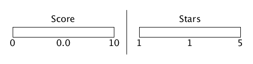
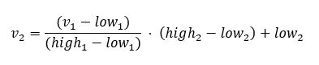

## Rescaling and Lerp

This is actually not code, but an important piece of math. With this equation, we transform a value from one scale to another. For Example, there are two ways of rating hotels. One is a score between zero and ten `[0,10]` and the other is a rating from one to five stars `[1,5]`.

The following formula rescales a value `v1` within a range of `[low1, high1]` to a new range `[low2, high2]`

Linear Interpolation (Lerp) is a special case of rescaling.

Lerp: From `[0,1]` to `[low,high]`
Inverse Lerp: From `[low,high]` to `[0,1]`

Most math libraries or frameworks already provide methods for rescaling. Rescaling between two arbitrary ranges is a combination of these methods: `Lerp (low2, high2, Inverse Lerp (low1, high1, v1))`.

The visualization is done in [Processing](https://processing.org/), which is a very useful java framework for creating small visual applications.
